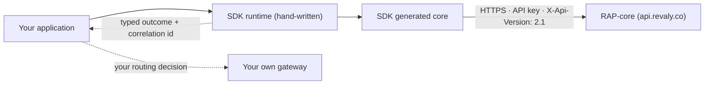

# Revaly RAP SDK (`rap-sdk`)

[](https://www.nuget.org/packages/Revaly.Sdk)
[](https://central.sonatype.com/artifact/co.revaly/revaly-sdk)
[](https://www.npmjs.com/package/@revaly/sdk)
[](https://pypi.org/project/revaly-sdk/)
[](https://packagist.org/packages/revaly/sdk)
[](https://pkg.go.dev/github.com/revaly-co/rap-sdk/languages/go)

[](https://github.com/revaly-co/RAP-sdk/actions/workflows/pipeline.yml)
[](https://securityscorecards.dev/viewer/?uri=github.com/revaly-co/RAP-sdk)
[](LICENSE)

Server-side SDKs for the **RAP V2 API** (RAP-core) in six languages — **.NET, Java, PHP,
TypeScript, Python, Go** — built around one promise: **you always know what happened to a
payment.**

Every SDK ships the same merchant-facing **failover & reconciliation contract**: every failed
call arrives as exactly one of three typed outcomes that tell you what you may safely do next,
and an ambiguous outcome arrives with the tool that resolves it. One monorepo, one deterministic
generation pipeline consuming cryptographically gated API specifications, one behaviour across
all six languages.

**New here?** Start with [the contract in thirty seconds](#the-contract-in-thirty-seconds), then
[pick your language](#pick-your-language). **Building with an AI agent?**
[`AGENTS.md`](AGENTS.md) states the whole contract in one machine-readable page.

## Who this is for

- **Merchant developers integrating RAP**, who want the standard, supported path onto the
  platform instead of a bespoke HTTP client — authentication, request building, API version
  pinning and failure classification arrive ready to use.
- **Teams routing meaningful traffic through RAP**, who need a documented, testable answer to
  "what does my checkout do if Revaly is briefly unreachable?" before they commit that traffic.
- **Platform and reliability engineers**, who get typed outcomes, correlation IDs on every
  response and error, values-free logging, and a mock transport that reproduces every failure
  row offline.

## The contract in thirty seconds

A failed charge is not the same as a payment that didn't happen. Failing over to your own
gateway on an ambiguous failure is how a cardholder gets charged twice. So the SDKs hand you a
verdict rather than a raw error:

| You get | It means | You do |
| --- | --- | --- |
| **PermanentRejection** | Received and rejected (400/401/403/404/422) | Fix or decline. Failing over repeats the same rejection anywhere. |
| **TransientFailure** | **Definitively not processed** (provably never sent, or `503` + `code: not_processed`) | Route to your own gateway immediately. |
| **OutcomeUnknown** | **May have been processed** (timeout after send, connection reset, ambiguous 5xx) | Reconcile first, then act on the verdict. |

Each language expresses this in its native idiom — exceptions in .NET/Java/PHP/Python, typed
classes in TypeScript, error values in Go — and the classification algorithm behind them is
identical and normative ([`docs/failover-contract.md`](docs/failover-contract.md)).

## What it looks like

TypeScript shown; the same flow, in your language's idiom, is the first thing in every
quickstart below.

```ts
import { RapClient, RapOutcomeUnknown, RapPermanentRejection, RapTransientFailure } from '@revaly/sdk';

const client = new RapClient({ apiKey: process.env.RAP_API_KEY! });

try {
    const transaction = await client.charge({
        amount: 1999,
        currency: 'USD',
        merchantTransactionId: 'order-1042', // your reconcile handle — required on every payment
        orderId: 'order-1042',
        paymentMethod: {
            fullName: 'Ada Lovelace',
            email: 'ada@example.com',
            creditCard: { number: '4111111111111111', cardVerificationCode: '999', expiryMonth: '12', expiryYear: '2030' },
        },
    });
    console.log('approved', transaction.transactionId);
} catch (failure) {
    if (failure instanceof RapPermanentRejection) {
        // Received and rejected. Fix the request or decline the payment.
    } else if (failure instanceof RapTransientFailure) {
        // Definitively not processed — route to your own gateway immediately.
    } else if (failure instanceof RapOutcomeUnknown) {
        // May have been processed — reconcile first, then act on the verdict.
        const verdict = await client.reconcile('order-1042', {
            maxAttempts: 5,
            overallBudgetMs: 30_000,
            initialDelayMs: 500,
        });
        if (verdict.kind === 'Found') {
            // The record IS visible — Found(Approved) means the money moved,
            // so this payment is already complete.
        } else if (verdict.kind === 'NotFoundYet') {
            // Not visible YET — hold and escalate per your risk policy.
        } else {
            // Verdicts are open for extension — always keep this branch.
        }
    } else {
        throw failure; // not a payment outcome (cancellation, validation, bugs)
    }
}
```

Payments are the safety-critical path, and the full API surface ships alongside them: payment
methods, transactions, and notify.

## Pick your language

Each quickstart takes a sandbox API key to a first classified charge in **under 15 minutes**, and
every example ships all three outcome classes plus the reconcile loop — the safety path is part
of the tutorial, not an exercise for the reader.

| Language | Quickstart | Install |
| --- | --- | --- |
| .NET | [`languages/dotnet`](languages/dotnet/README.md) | `dotnet add package Revaly.Sdk` |
| Java | [`languages/java`](languages/java/README.md) | `co.revaly:revaly-sdk` (Maven Central) |
| PHP | [`languages/php`](languages/php/README.md) | `composer require revaly/sdk` |
| TypeScript | [`languages/typescript`](languages/typescript/README.md) | `npm install @revaly/sdk` |
| Python | [`languages/python`](languages/python/README.md) | `pip install revaly-sdk` |
| Go | [`languages/go`](languages/go/README.md) | `go get github.com/revaly-co/rap-sdk/languages/go` |

The registries above are the primary, documented install path. Per-language
[GitHub release artifacts](https://github.com/revaly-co/RAP-sdk/releases) ship with every
version as the provenance anchor and registry-outage fallback (ADR-SDK-031) — each asset carries
a `.sha256` checksum and a `provenance.json` binding it to the exact source and spec it was built
from. Sandbox and live share one URL: your API key's scope selects the environment.

## How it works

The SDK sits in your infrastructure, between your application and the RAP V2 API:



Three properties follow from that shape:

1. **Your routing decision stays yours.** The SDK's job ends when it tells you which outcome
   class you are in, with the evidence behind it. Whether an unaffected payment goes to your own
   gateway is a decision your system makes, above the SDK, against your own risk policy.
2. **The runtime is the product.** The generated core is spec-derived plumbing — models,
   endpoint bindings, serialization. Everything that carries the contract lives in a small,
   stable hand-written runtime: classification, the reconcile helper, deadlines, logging and
   scrubbing, the `User-Agent`, the mock transport.
3. **One factory, six outputs.** All six cores are generated from the same checksum-verified
   spec artifact by the same pipeline, so behaviour agrees across languages by construction
   rather than by review.

## Design guarantees

The SDK is deliberately small at its boundary. In a payments client, silent cleverness is where
double charges come from — so every guarantee below is one you can rely on and test:

- **Each charge is sent exactly once.** Retry policy stays in your hands, with the
  classification that makes it safe to exercise. There is one loop in the product: the explicit,
  caller-bounded reconcile re-poll you configure.
- **Every call stands alone.** The SDK holds no cross-request state and no circuit breaker, so
  behaviour under load is the same behaviour you tested.
- **Ambiguity is reported as ambiguity.** Error codes and transaction types are open sets: a code
  the SDK doesn't recognize resolves to *unknown outcome*, and a transport that cannot prove a
  request was never sent says exactly that. The safe-to-fail-over class is reserved for failures
  the platform or the transport can prove.
- **Logging is values-free by default.** Identifiers, statuses, classes and correlation IDs go to
  your logger; card data, keys and hosts stay out of it (PCI scope, ADR-SDK-020). A wire-trace
  hook feeds your own structured observability with already-scrubbed payloads.
- **Every API binding is generated.** The core is produced deterministically from a pinned,
  checksum-verified spec artifact, and CI fails the build on a one-byte drift between the
  committed core and a clean regeneration.

## Where it fits

**Strongest fit.** Server-side payment paths — an application, service or worker that calls RAP
from your own infrastructure, in any of the six supported languages. Teams with an existing
gateway relationship get the most from the contract, because a `TransientFailure` verdict is
immediately actionable for them.

**Design boundaries.** V1 is server-side, so browser and mobile clients keep talking to your
backend rather than to RAP directly. Traffic splitting and A/B routing between RAP and your own
gateway live in your system, above the SDK, where your business rules already are. And the SDK
surfaces failures for your handler to act on rather than invoking Revaly's internal recovery
paths itself — that separation is what keeps the outcome of a payment unambiguous.

**Edge cases worth knowing.**
- **`NotFoundYet` is "not visible yet," never "didn't happen."** Platform visibility is
  asynchronous, and the lag is widest exactly when RAP-core is degraded. V1 gives you
  `Found | NotFoundYet`; a provable `SafeToFailover` verdict arrives with platform P-2 as a minor
  release, which is why every verdict switch keeps a default branch.
- **Pinning `X-Api-Version: 2.0` narrows the contract.** `ErrorResponse.code` is outside the 2.0
  documented surface, so fast failover narrows to client-provable never-sent failures. Pin 2.1
  unless you have a frozen 2.0 integration.
- **Edge-generated errors are HTML, not `ErrorResponse`.** Front Door and WAF responses fall
  through the open-string `code` path to `OutcomeUnknown` by design; only RAP-core's own
  `503 {code: "not_processed"}` licenses immediate failover.
- **This is the RAP SDK.** The Revaly Trust Network has its own separate library for its own API
  and audience (ADR-SDK-017).

## What makes it different

| Approach | What you get | Where it leaves you |
| --- | --- | --- |
| Hand-rolled HTTP client | Full control | You design the failure taxonomy yourself, and an ambiguous 5xx is a judgement call under checkout pressure |
| Generic retrying HTTP wrapper | Fewer transient blips | A retried `POST /payments` can charge twice; the wrapper cannot tell which 503 is safe |
| Generated-only client | Complete API surface | Models and endpoints, with the classification and reconcile logic still yours to write |
| **Revaly RAP SDK** | Full surface **plus** the typed failover contract, reconcile helper, and offline-testable failure taxonomy | Routing decisions stay yours by design |

The differentiator is that the contract is *specified*, not merely implemented: a normative
classification algorithm, one behaviour in six languages, and a live contract smoke on every
release that proves it.

## How a release is proven

Every release tag runs the full gauntlet: spec-artifact re-verification, six-language
regeneration diff, build + unit tests per language, and a **live contract smoke** that exercises
the failover taxonomy — including a fault-injected `503 + not_processed` and reconcile verdicts —
against real infrastructure, twice, in every language. Any language red blocks the release for
all six. Each published version's release notes pin the exact spec commit it was generated from.

Versioning is semver per package with per-language tags (`typescript/v0.5.1`), and a mock
transport ships in every SDK so your failover handler is testable without network — see each
quickstart's "testing your failover handler" section, or the
[failover cookbook](docs/failover-cookbook.md).

## Documentation

The design record is public and complete — the docs are the source of truth, not an afterthought.

**Start here**

| Document | What it gives you |
| --- | --- |
| [`docs/failover-cookbook.md`](docs/failover-cookbook.md) | Task-oriented recipes: handle each outcome, tune reconcile, test offline, debug with correlation IDs |
| [`AGENTS.md`](AGENTS.md) | The whole contract on one page, structured for AI coding agents |
| [`CONTRIBUTING.md`](CONTRIBUTING.md) · [`SUPPORT.md`](SUPPORT.md) | How to file issues and PRs, and where to get help |

**Go deeper**

| Document | What it gives you |
| --- | --- |
| [`docs/README.md`](docs/README.md) | Index, reading order, and the dated status snapshot |
| [`docs/failover-contract.md`](docs/failover-contract.md) | The normative safety contract, with sequence diagrams |
| [`docs/architecture.md`](docs/architecture.md) | Components, data flow, trust boundary, repo shape |
| [`docs/runtime-tdd.md`](docs/runtime-tdd.md) | The per-language runtime surface, setting by setting |
| [`docs/dx-contract.md`](docs/dx-contract.md) | The developer-experience bar every SDK meets |
| [`docs/pipeline-and-release.md`](docs/pipeline-and-release.md) | Pipeline stages, publish mechanics, versioning policy |
| [`docs/adr/README.md`](docs/adr/README.md) | Every architectural decision, numbered and dated |

## Support & security

Questions and bug reports belong in [GitHub issues](https://github.com/revaly-co/RAP-sdk/issues)
— see [`SUPPORT.md`](SUPPORT.md) for what to include. Vulnerabilities go to
[`SECURITY.md`](SECURITY.md) or `security@revaly.co` rather than a public issue. Test suites and
mock transports use synthetic data only.

Supported versions: while the SDKs are pre-1.0, security fixes land on the **latest release** of
each language SDK ([`SECURITY.md`](SECURITY.md)). At GA this widens to current plus previous minor
per package, with security patches on the latest GA of every supported major.

## Status

**Published and installable from all six registries** — NuGet, Maven Central, npm, PyPI,
Packagist, and the Go module proxy — since 2026-08-07 (ADR-SDK-031). GitHub release artifacts
continue as the provenance anchor and fallback channel.

Pre-1.0: the API surface is stable in shape, and per-language idiom may still evolve until GA,
with every breaking change called out in that language's release notes.

## License

[Apache-2.0](LICENSE) · [NOTICE](NOTICE)
