# RAP Integration SDK — Architecture

**Source:** RFC-046 (Approved 2026-07-10, v10) · Decisions: ADR-SDK-001 (hybrid), 006 (gated spec),
013 (publish gate), 015 (GA order), 016 (monorepo), 022 (namespace)

## 1. What this is

Six server-side client SDKs — **Python, TypeScript, Go, .NET, PHP, Java** — for the **RAP V2 API**
(RAP-core, `api.revaly.co`; OpenAPI title "Revaly", spec v2.1.x, OpenAPI 3.0.3). The API surface:
payments (charge, authorize, capture, void, refund, refund-cancel), payment methods, transactions,
notify.

Two things make this more than six HTTP clients:

1. **One manufacturing line.** All six SDKs are generated + assembled by one deterministic
   pipeline from **gated** spec artifacts (ADR-SDK-006); a release is traceable to a spec commit
   SHA. The pipeline is the product's factory; the runtime is the product.
2. **One failover contract.** The SDK's differentiating value is a safety contract
   (`failover-contract.md`): typed failure classes, a double-charge-safe reconcile procedure, and
   a provable fast-failover signal.

## 2. System context

```mermaid
flowchart LR
    subgraph merchant["Merchant infrastructure (trust boundary: SDK runs HERE)"]
        app["Merchant application"] --> rt["SDK runtime (hand-written)"]
        rt --> core["SDK generated core"]
    end
    core -->|"HTTPS + API key + X-Api-Version: 2.1 + User-Agent: revaly-sdk-*"| edge["AFD / WAF edge"]
    edge --> rap["RAP-core (RAP V2 API)"]
    rap --> gw["Payment gateways"]
    rap -.->|"request telemetry (User-Agent segmentation)"| ai["Platform telemetry"]

    subgraph factory["SDK factory"]
        spec["Platform repo: canonical OpenAPI spec + accuracy gates"] -->|"gated spec artifact (SHA-pinned)"| pipe["rap-sdk pipeline: validate → generate ×6 → build+test → contract smoke (Sandbox) → package → publish"]
        pipe --> reg["npm · PyPI · NuGet · Packagist · Maven Central · pkg.go.dev"]
    end
    reg -->|"install"| merchant
```



Trust boundary consequences (RFC §5.1, ADR-SDK-004): RAP-core's responsibility ends at the HTTP
response; the SDK's ends at classifying the failure as a typed error; routing decisions belong to
the merchant's system above the SDK. The SDK is an untrusted client — `User-Agent` is telemetry,
never a trust signal. API keys are merchant-held, injected at init, never persisted or logged. The
SDK never resubmits and never calls `bypassPlatform`.

## 3. Component model (per language)

| | Generated core | Hand-written runtime |
| --- | --- | --- |
| **Contents** | Request/response models, endpoint bindings, serialization | Client construction & config, auth header injection, `X-Api-Version` pinning, deadlines, typed error taxonomy + classification, `reconcile` helper, `User-Agent`, correlation-id surfacing, logging + scrubbing, wire-trace hook, mock transport |
| **Source of truth** | Gated OpenAPI spec artifact (ADR-SDK-006) | `runtime-tdd.md` + `failover-contract.md` + `dx-contract.md` |
| **Changes via** | Regeneration only — never hand-edited (CI-enforced diff check) | Normal PRs |
| **Stability** | Churns with the API | Small, stable — "the runtime is the product" |
| **Merchant imports** | Re-exported through the runtime's namespace | The one package merchants see |

## 4. The six languages

All six cores are **generated, compiled, and contract-tested in CI from day one** (no language
starts later from scratch). GA investment order (ADR-SDK-015, decided by Charles 2026-07-10):

**.NET → Java → PHP → TypeScript → Python → Go**

.NET is dogfooded: it becomes the client of the platform's own E2E tests before any merchant sees
it. Go is last — its module path is the highest-permanence distribution binding (ADR-SDK-022), so
it publishes only once namespace + pipeline are fully settled.

## 5. Repository

Monorepo **`revaly-co/rap-sdk`** (ADR-SDK-016; namespace per ADR-SDK-022 — created under the
existing `revaly-co` org, decoupled from any broader org migration). Public (ADR-SDK-012), with
protected branches, PR-only merges, and the publish protection of ADR-SDK-013 (single human gate =
release cut; machine gates: tag-restricted publish environment, maintainer-only tag protection,
OIDC trusted publishing).

```
rap-sdk/
  spec/                    # pinned gated spec artifact reference + checksums
  languages/<lang>/        # { core/ (generated), runtime/, tests/ } × 6
  pipeline/                # generation configs, templates, publish workflows
  docs/                    # this documentation set (adr/ + design docs)
```

## 6. Versioning & telemetry

- **Semver per package; SDK major tracks the RAP V2 API major.** Minor/patch follow API changes
  within the major; every package version maps to a spec commit SHA in release notes. Pre-1.0
  betas during build-out; 1.0 GA per language in GA order. (`pipeline-and-release.md` §4.)
- **Adoption telemetry** rides `User-Agent: revaly-sdk-<language>/<semver> (<runtime>; <os>)`
  (ADR-SDK-005) — platform-side segmentation feeds the Product adoption KPI and per-version error
  dashboards. **No SDK phone-home in V1.**

## 7. External dependencies & gates

| Dependency | Blocks | Reference |
| --- | --- | --- |
| Platform P-1 — `ErrorResponse.code` on 5xx | SDK **V1** | ADR-SDK-007; platform ADR 013 |
| Platform P-2 — synchronous intent reservation | SDK **GA** (`SafeToFailover`) | ADR-SDK-008; platform ADR 014 |
| Gated spec artifact publication | first generation | ADR-SDK-006; platform ADR 016 |
| Spec corrections (`format: int64`, id-length 100) | first generation | platform ADR 015 |
| Generator bake-off (OQ-1) | build start | `open-items.md` |
| Registry + publish-env provisioning (OQ-3) | first publish | ADR-SDK-011/013/022 |
| AFD/WAF edge behaviour verification (OQ-11) | Wave-1 GA (hard gate) | `open-items.md` |
| Deadline defaults from telemetry (OQ-6) | Wave-1 GA — ✅ ratified 2026-07-20 (overall 30 s; connect deferred to OQ-11) | ADR-SDK-027 |
| Sandbox parity + Enablement-issued test keys (OQ-4) | contract-smoke + GA | ADR-SDK-014 |
| Apache-2.0 Legal ratification (OQ-12) | first publish | ADR-SDK-019 |

## 8. What this architecture deliberately does not do

- No browser/mobile targets; no traffic splitting or A/B routing; no automatic resubmission; no
  `bypassPlatform`; no retry/treatment configuration; no Client Portal surfacing (PRD non-goals).
- No client-side circuit breaker, no hidden retries, no cross-request state (ADR-SDK-004).
- No RTN SDK coupling — separate product, separate pipeline (ADR-SDK-017).
