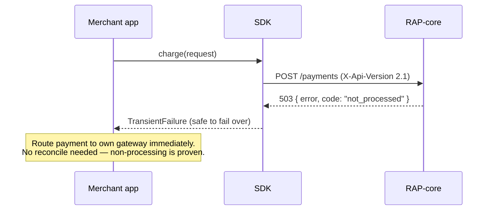
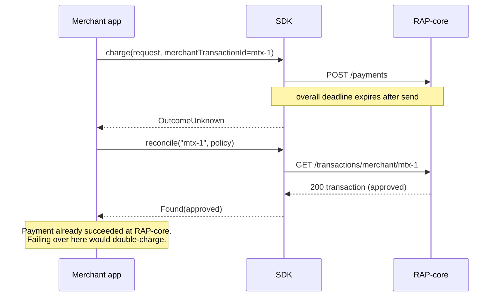
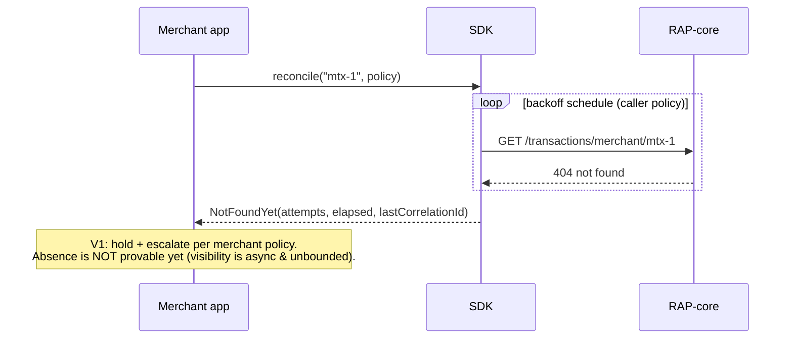
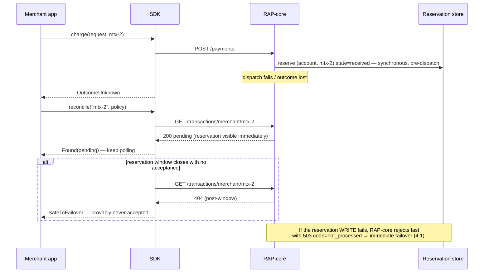

# RAP Integration SDK — Failover & Reconciliation Contract

**Source:** RFC-046 §5 (Approved 2026-07-10, v10) · ADR-SDK-002 (taxonomy), 003 (reconcile),
004 (trust boundary), 007 (P-1 signal), 008 (P-2 reservation), 009 (V1 verdicts)
**Safety-critical.** This document is the contract every runtime implements and every quickstart
teaches. When in doubt, the rule is: **only promise what the platform can prove.**

## 1. The hazard this contract exists to prevent

A failed `POST /payments` does not mean the payment didn't happen. If the merchant blind-fails-over
to their own gateway on an ambiguous failure, the cardholder can be charged **twice** — once at
RAP-core, once at the merchant's gateway. Every rule below derives from that hazard.

## 2. Typed failure classes (V1)

| Class | Trigger | Payment state at RAP-core | Caller action |
| --- | --- | --- | --- |
| **PermanentRejection** | HTTP 400 / 401 / 403 / 404 / 422 | Received and rejected | Fix or decline. **Never fail over** — the same request fails anywhere. |
| **TransientFailure** *(safe to fail over)* | Client-provable never-sent (connection refused; DNS or TLS failure before the request was accepted); **503 with `code: not_processed`** | **Definitively not processed** | Route to own gateway immediately (the PRD's first-layer failover path). |
| **OutcomeUnknown** | Deadline exceeded after send; connection reset mid-flight; 500; 502/504 (edge); **503 without `code: not_processed`** | **May have been processed** | **Reconcile before acting** (§3). |

Classification algorithm (normative):

```
if transport error and request provably never sent          → TransientFailure
if HTTP status in {400, 401, 403, 404, 422}                 → PermanentRejection
if HTTP status == 503 and body.code == "not_processed"      → TransientFailure
if HTTP status >= 500                                        → OutcomeUnknown
if deadline exceeded after send / reset / ambiguous          → OutcomeUnknown
```

Rules: never classify from `error` message text; treat `details` as opaque; unrecognized `code`
values = absent (falls to OutcomeUnknown); when a language's HTTP stack cannot prove the request
was never sent, classify OutcomeUnknown — never guess toward "safe".

Why 503 needs the `code`: the platform maps upstream 502/503/504-after-dispatch **and** its own
circuit-breaker-open case to the same bare 503. Only `code: not_processed` (emitted solely for
circuit-open and pre-dispatch rejections — provable non-dispatch) licenses immediate failover.
Requires platform P-1; rides `X-Api-Version: 2.1` (SDK default pin).

## 3. Reconciliation (OutcomeUnknown procedure)

Stands entirely on existing surface: `merchantTransactionId` (required on every payment request)
+ `GET /transactions/merchant/{merchantTransactionId}`.

**V1 verdicts — deliberately only two** (ADR-SDK-009): `Found(outcome)` | `NotFoundYet`.
There is **no** `SafeToFailover` value in V1. "Not found" is *not yet visible*, never "doesn't
exist": platform visibility is asynchronous and unbounded (widest exactly when RAP-core is
degraded), and a platform-side retry that succeeded may not be findable under the original id
until P-2 lands.

Procedure:

1. On OutcomeUnknown → call the `reconcile` helper.
2. **Found(approved)** → done; **no failover** (the money moved).
3. **Found(declined / terminal-failed)** → merchant decision (their own gateway is now safe).
4. **NotFoundYet** → **hold and re-poll** with backoff; on sustained NotFoundYet, escalate per
   merchant policy. If a merchant chooses to fail over anyway, that decision lives in *their*
   code against *their* risk policy — the SDK does not bless it and the docs say so.

**GA (post-P-2):** the platform writes a synchronous intent reservation before gateway dispatch and
surfaces it as a *pending* state on the same GET. Then: not found **after the reservation window
closes** ⇒ provably never accepted ⇒ the helper may return **`SafeToFailover`** (added as a minor
release; verdict types are designed open for extension now).

## 4. Sequence diagrams

### 4.1 Fast failover — RAP-core breaker open (V1, requires P-1)



### 4.2 OutcomeUnknown → reconcile → Found (no failover)



### 4.3 OutcomeUnknown → NotFoundYet → hold and re-poll (V1)



### 4.4 GA — intent reservation makes absence provable (requires P-2)



## 5. Boundaries (what the SDK never does)

- Never resubmits a payment; never invokes `bypassPlatform` (second-layer recovery is
  RAP-core-internal).
- No circuit breaker, no suppression windows, no hidden retries — stateless and deterministic
  (ADR-SDK-004); the only loop is the explicit, caller-bounded reconcile re-poll.
- Never derives safety from message strings, latency heuristics, or wait lengths.

## 6. Verification obligations

- **OQ-11 (hard pre-GA gate):** the 502/504/reset rows above are design assumptions until
  Front Door / WAF edge behaviour is verified against them.
- **Mock transport** (DX contract §d) must simulate every row of the §2 table, both §3 verdicts,
  and — post-P-2 — pending-then-terminal and pending-then-absent scenarios: a merchant must be
  able to unit-test their failover handler with no network.
- Contract-smoke (pipeline stage 4) exercises the taxonomy against Sandbox each release
  (Enablement-issued CI key, ADR-SDK-014).
