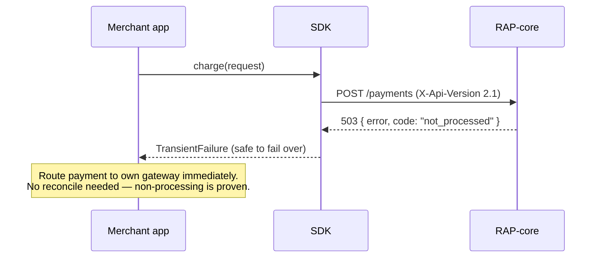
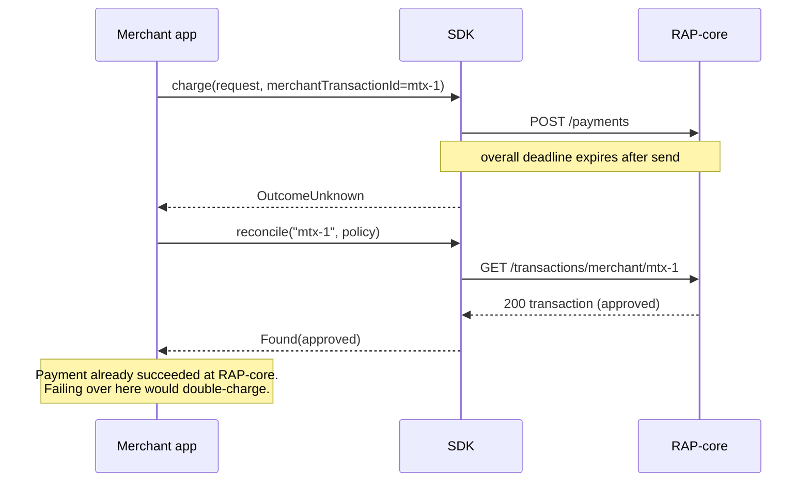
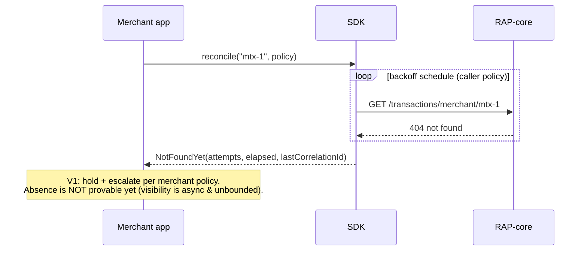
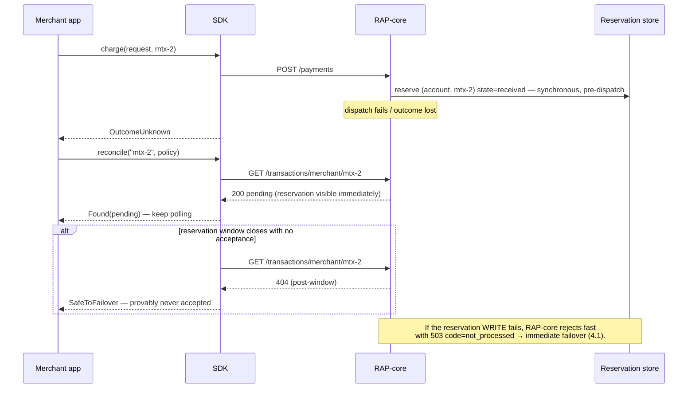

# RAP Integration SDK — Failover & Reconciliation Contract

**Source:** RFC-046 §5 (Approved 2026-07-10, v10) · ADR-SDK-002 (taxonomy), 003 (reconcile),
004 (trust boundary), 007 (P-1 signal), 008 (P-2 reservation), 009 (V1 verdicts)
**Safety-critical.** This document is the contract every runtime implements and every quickstart
teaches. When in doubt, the rule is: **only promise what the platform can prove.**

> **Reading this as a specification.** The body states the contract as the guarantees each runtime
> makes. Those guarantees have exact edges, and the prohibitions that define them are restated
> word-for-word in [Appendix A](#appendix-a--normative-prohibitions-verbatim). Appendix A is the
> normative text: where an implementation question turns on a boundary, it is the authority.

## 1. The hazard this contract exists to prevent

A failed `POST /payments` does not mean the payment didn't happen. If the merchant blind-fails-over
to their own gateway on an ambiguous failure, the cardholder can be charged **twice** — once at
RAP-core, once at the merchant's gateway. Every rule below derives from that hazard.

## 2. Typed failure classes (V1)

| Class | Trigger | Payment state at RAP-core | Caller action |
| --- | --- | --- | --- |
| **PermanentRejection** | HTTP 400 / 401 / 403 / 404 / 422 | Received and rejected | Fix or decline — failing over reproduces the same rejection anywhere. |
| **TransientFailure** *(safe to fail over)* | Client-provable never-sent (connection refused; DNS or TLS failure before the request was accepted); **503 with `code: not_processed`** | **Definitively not processed** | Route to own gateway immediately (the PRD's first-layer failover path). |
| **OutcomeUnknown** | Deadline exceeded after send; connection reset mid-flight; 500; 502/504 (edge); **503 without `code: not_processed`** | **May have been processed** | **Reconcile before acting** (§3). |

Classification algorithm (normative):

```
if transport error and request provably never sent          → TransientFailure
if HTTP status in {400, 401, 403, 404, 422}                 → PermanentRejection
if HTTP status == 503 and body.code == "not_processed"      → TransientFailure
if HTTP status >= 500                                        → OutcomeUnknown
if deadline exceeded after send / reset / ambiguous          → OutcomeUnknown
```

Rules the algorithm rests on: classification takes exactly two inputs, HTTP status and
`ErrorResponse.code`; `details` is carried through as opaque; `code` is read as an open string, so
an unrecognized value is handled as absent and resolves to OutcomeUnknown; and where a language's
HTTP stack cannot prove the request was never sent, the outcome is OutcomeUnknown. The
safe-to-fail-over class is reserved for non-dispatch the transport or the platform can prove.
(Verbatim prohibitions: [Appendix A](#appendix-a--normative-prohibitions-verbatim) §A1.)

Why 503 needs the `code`: the platform maps upstream 502/503/504-after-dispatch **and** its own
circuit-breaker-open case to the same bare 503. Only `code: not_processed` (emitted solely for
circuit-open and pre-dispatch rejections — provable non-dispatch) licenses immediate failover.
Requires platform P-1; rides `X-Api-Version: 2.1` (SDK default pin).

## 3. Reconciliation (OutcomeUnknown procedure)

Stands entirely on existing surface: `merchantTransactionId` (required on every payment request)
+ `GET /transactions/merchant/{merchantTransactionId}`.

**V1 verdicts — exactly two, by design** (ADR-SDK-009): `Found(outcome)` | `NotFoundYet`. The
verdict set matches what the platform can currently prove: `NotFoundYet` means *not yet visible*,
because platform visibility is asynchronous and unbounded (widest exactly when RAP-core is
degraded), and a platform-side retry that succeeded may not be findable under the original id
until P-2 lands. A verdict asserting provable absence therefore arrives with P-2, not before
(§A2).

Procedure:

1. On OutcomeUnknown → call the `reconcile` helper.
2. **Found(approved)** → the payment is complete; the money moved, so it settles here.
3. **Found(declined / terminal-failed)** → merchant decision (their own gateway is now safe).
4. **NotFoundYet** → **hold and re-poll** with backoff; on sustained NotFoundYet, escalate per
   merchant policy. A merchant who chooses to fail over anyway owns that decision in *their* code
   against *their* risk policy; the docs say plainly that the contract does not support it, so the
   choice is made knowingly.

**GA (post-P-2):** the platform writes a synchronous intent reservation before gateway dispatch and
surfaces it as a *pending* state on the same GET. Then: not found **after the reservation window
closes** ⇒ provably never accepted ⇒ the helper may return **`SafeToFailover`** (added as a minor
release; verdict types are designed open for extension now).

## 4. Sequence diagrams

### 4.1 Fast failover — RAP-core breaker open (V1, requires P-1)



### 4.2 OutcomeUnknown → reconcile → Found (no failover)



### 4.3 OutcomeUnknown → NotFoundYet → hold and re-poll (V1)



### 4.4 GA — intent reservation makes absence provable (requires P-2)



## 5. Guarantees at the boundary

The SDK's surface is deliberately narrow, and each of these is a guarantee a merchant can rely on
and test (verbatim prohibitions: §A3):

- **Each payment is sent exactly once.** The SDK delivers the caller's request and reports the
  outcome; resubmission and second-layer recovery (`bypassPlatform`) remain RAP-core-internal.
- **Behaviour is stateless and deterministic** (ADR-SDK-004): the same inputs classify the same
  way on every call, because there is no breaker state, suppression window, or hidden retry to
  carry between requests. The one loop in the product is the explicit, caller-bounded reconcile
  re-poll.
- **Safety derives from evidence only** — HTTP status and `ErrorResponse.code`. Message strings,
  latency, and wait lengths are recorded for the operator and excluded from classification.

## 6. Verification obligations

- **OQ-11 — verified 2026-07-21 (ADR-SDK-029):** the 502/504/reset rows above are confirmed
  against live Front Door / WAF behaviour (30-day production edge census + live probes; full
  evidence in the ADR). Two verified nuances: an edge **504 can fire in ~4 s** (AFD's
  origin-connect bound) — a 504 never implies the deadline elapsed, classification stays
  status-only; and edge-generated error bodies are **HTML, never `ErrorResponse`** — the
  open-string `code` fallthrough (absent → OutcomeUnknown) is load-bearing. Only the
  platform's own `503 {code: "not_processed"}` licenses fast failover; it passes through the
  edge unmodified, and the edge cannot mint it.
- **Mock transport** (DX contract §d) must simulate every row of the §2 table, both §3 verdicts,
  and — post-P-2 — pending-then-terminal and pending-then-absent scenarios: a merchant must be
  able to unit-test their failover handler with no network.
- Contract-smoke (pipeline stage 4) exercises the taxonomy against Sandbox each release
  (Enablement-issued CI key, ADR-SDK-014).

## Appendix A — normative prohibitions (verbatim)

The prohibitions below are the normative edges of the §2/§3/§5 guarantees, restated in their
original wording. They are fixed by RFC-046 §5 and ADR-SDK-002/003/004/007/009: reversing one
requires an ADR revision, never a code choice or a doc edit. Where the body's affirmative phrasing
and this appendix could be read differently, **this appendix governs**.

### A1 — Classification (§2)

> Rules: never classify from `error` message text; treat `details` as opaque; unrecognized `code`
> values = absent (falls to OutcomeUnknown); when a language's HTTP stack cannot prove the request
> was never sent, classify OutcomeUnknown — never guess toward "safe".

Further: `ErrorResponse.code` and `transactionType` are **open strings, never closed enums**. Only
the platform's own `503 {code: "not_processed"}` licenses fast failover; the edge cannot mint it,
and edge-generated error bodies are **HTML, never `ErrorResponse`**.

### A2 — Reconcile verdicts (§3)

> There is **no** `SafeToFailover` value in V1. "Not found" is *not yet visible*, never "doesn't
> exist".

V1 verdicts are `Found | NotFoundYet` only. Verdict types stay **open for extension**: a
default/else branch is mandatory in every language and in every example. `SafeToFailover` arrives
with platform P-2 as a **minor** release. A merchant who fails over on sustained `NotFoundYet`
does so against their own risk policy; the SDK does not bless it.

### A3 — Runtime boundaries (§5)

> Never resubmits a payment; never invokes `bypassPlatform` (second-layer recovery is
> RAP-core-internal).
>
> No circuit breaker, no suppression windows, no hidden retries — stateless and deterministic
> (ADR-SDK-004); the only loop is the explicit, caller-bounded reconcile re-poll.
>
> Never derives safety from message strings, latency heuristics, or wait lengths.

Also normative, from ADR-SDK-020: no payload values at default verbosity; API keys never appear in
logs **or exception messages**; mock transports use synthetic data only.
